# 😎 Nomad-Next14-Tutorial

 `by Kyojin Hwang`


## 💻 Version


## 📚Category

- [🎬 Routing](#-Routing)

---

### 💡 Install & Setting

### 1. 폴더생성

#### terminal 에서 폴더를 만들어준다.

```bash
mkdir [폴더명]
```

### 2. npm init -y 및 next 설치

```bash
// default값으로 설정된 package.json 생성
npm init -y

// next 설치 최신버전으로
npm install react@latest next@latest react-dom@latest
```

### 3. License 변경

```json
{
  "name": "nomad-next14-tutorial",
  "version": "1.0.0",
  "description": "",
  "main": "index.js",
  "scripts": {
    "dev": "next dev"
  },
  "keywords": [],
  "author": "",
  // 이 부분 변경
  "license": "MIT",
  "dependencies": {
    "next": "^14.2.4",
    "react": "^18.3.1",
    "react-dom": "^18.3.1"
  },
  "devDependencies": {
    "@types/node": "20.14.10",
    "@types/react": "18.3.3",
    "typescript": "5.5.3"
  }
}
```

---

## 🎬 Routing

### 1️⃣ Defining Routes

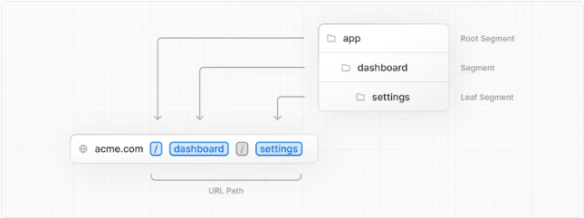
(사진출처 : [NextJS 공식홈페이지 Defining Routes](https://nextjs.org/docs/app/building-your-application/routing/defining-routes))

#### 🎈 Root Segment

- app 안의 폴더 로 들어가지않는 `page`와 `layout`은 root segment다.

#### 🎈 Page Create

- 폴더를 생성하고 page.tsx 파일을 생성하면 페이지가 된다.

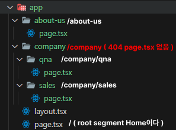

---

### 2️⃣ Not Found Routes

#### 🎈 404 Error 페이지

- not-found.tsx를 만들어서 사용 할 수 있다.
- 일반 jsx 방식으로 만들면 된다.

  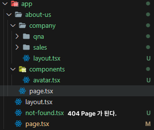

#### 🎈 Client Components Error

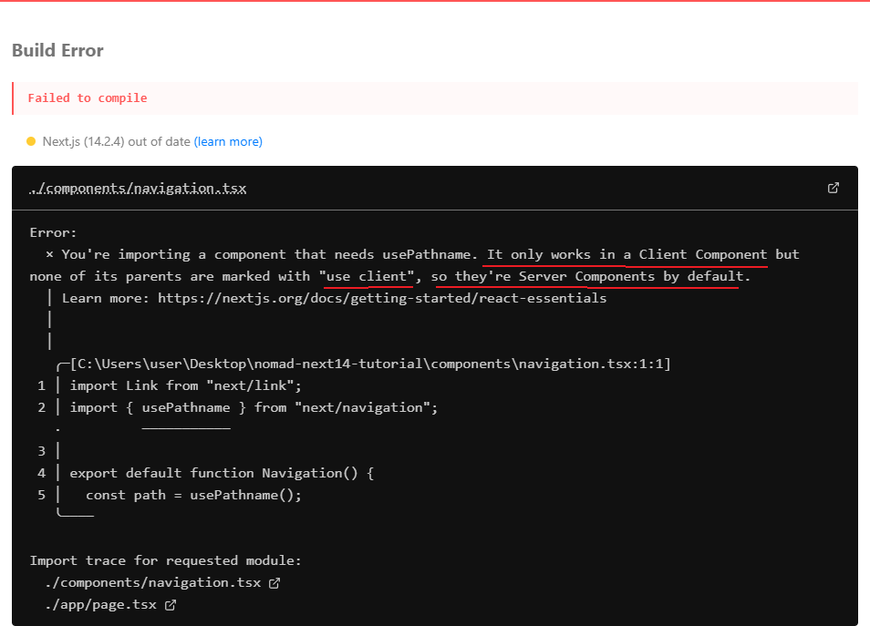

- 클라이언트 컴포넌트에는 맨상단에 `"use client"` 기입해준다.

```javascript
"use client";
import Link from "next/link";
import { usePathname } from "next/navigation";

export default function Navigation() {
  const path = usePathname();

  return (
    <nav>
      <ul>
        <li>
          <Link href="/">Home</Link> {path === "/" ? "🔥" : ""}
        </li>
        <li>
          <Link href="/about-us">About Us</Link>{" "}
          {path === "/about-us" ? "🔥" : ""}
        </li>
      </ul>
    </nav>
  );
}
```

---

### 3️⃣ SSR vs CSR

- `React`
  - client side rendering
  - 브라우저가 rendering 작업을 한다.
  - create-react-app 을 사용하여 app을 생성하면 client side application
- `Next`
  - server side rendering
  - 서버가 rendering 작업을 한다.

---

### 4️⃣ Hydration

#### 🎈 Link Component

- react 와 같이 페이지를 이동할 때 사용된다.
- reload 되지 않는다.

---

### 5️⃣ Layouts

#### 🎈 Layouts 의 rendering 방식

```javascript
<Layout>
  <AboutLayout>
    <AboutUs />
  </AboutLayout>
</Layout>

1. 레이아웃 랜더링
2. children으로 해당 URL에 맞는 컴포넌트가 들어간다.
```

---

### 6️⃣ Route Group & Metadata

#### 🎈 Route Group

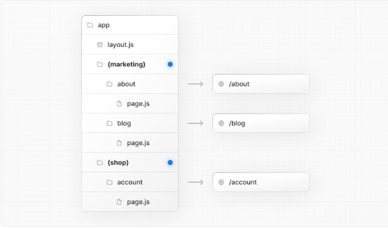
(사진출처 : [NextJS 공식홈페이지 라우트 경로그룹](https://nextjs.org/docs/app/building-your-application/routing/route-groups))

- (파일명) => () 를 통해 URL에 영향을 주지않는다.
- 그룹을 만든다.

  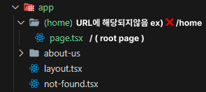

#### 🎈 MetaData

[Nextjs 메타데이터 설명](https://nextjs.org/docs/app/building-your-application/optimizing/metadata)

[Nextjs 메타데이터 함수](https://nextjs.org/docs/app/api-reference/functions/generate-metadata#the-metadata-object)

- client component에서는 사용할 수 없다.

```javascript
//RootLayout.tsx
export const metadata: Metadata = {
  title: {
    // %s 는 page.tsx 영역에서 지정해준 title
    template: "%s | Template",
    // page.tsx에서 title을 지정해주지 않을 경우 [기본타이틀]
    default: "Loading...",
  },
  description: "Generated by Next.js",
};

//home.tsx
export const metadata = {
  // %s 가 된다.
  title: "HOME",
};

const Home = () => {
  return (
    <div>
      <h1>Hello!</h1>
    </div>
  );
};

export default Home;
```

### 6️⃣ Dynamic Routes

```javascript
//static route
/about-us

//dynamic route
/movie/:id
/movie/14
```

#### 🎈 파일명

- [paramsName] : `/movies/123` (123처럼 params가 들어갈수있다.)
  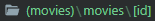
- ex) http://localhost:3000/movies/123?region=kr&page=2 로 페이지 진입시

```javascript
export default function MovieDetail(props) {
  console.log(props);
  return <h1>Movie!</h1>;
}

// 아래와 같이 데이터를 받는다.
{
  params: { id: "123" },
  searchParams: { region: "kr", page: "2" },
};
```

## 🎬 Data Fetching

### 1️⃣ Data `Client` & `Server` Fetch

- <a href="">Client Fetch</a>
- <a href="">Server Fetch</a>

### 2️⃣ Loading Components

- 만약 서버에서 `Loading 이 걸릴경우` 또는 `로딩을 줄경우`
  <br /> `loading.tsx`를 `생성`해야 로딩될 때 도 페이지로 이동되며 페이지가 보인다.

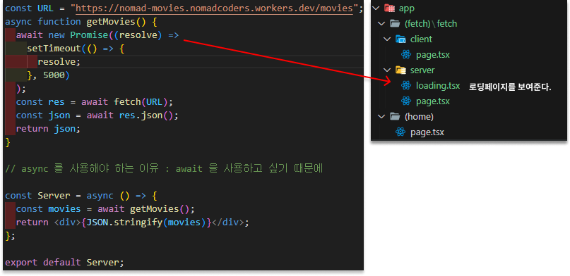

### 3️⃣ Parallel Requests

- getMovie 에서 5초이후 date fetching 을 할 경우
  getvideos 를 5초이후 실행한다.

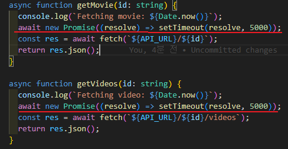
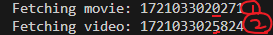

- 🎈 병렬적 사용 방법 : promise.all 을 사용하여 동시에 await 한다.

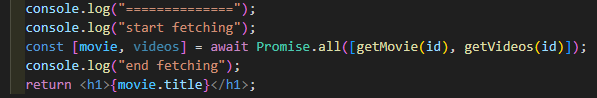
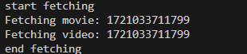
